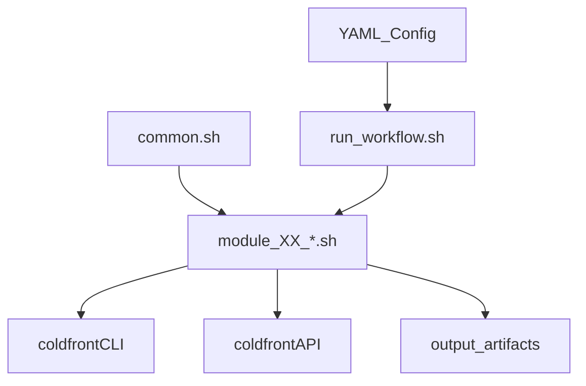

# System Test Workflow (Script-Based)

This document describes the script-driven system test workflow for the ORCD Rental Portal.
It replaces the pytest-heavy approach with per-module shell scripts that are YAML-controlled,
CI-friendly, and easy to run locally.

## Overview

### Purpose
- Provide repeatable workflows for provisioning users, projects, reservations, billing data, and APIs.
- Keep data and parameters in human-editable YAML.
- Make scripts usable outside CI (manual setup, approval flows, ad-hoc testing).

### Design Principles
1. **YAML-driven**: test data and module selection are declared in `tests/setup/config`.
2. **Script-first**: each module is a shell script with clear inputs/outputs.
3. **Reusable**: scripts can be run locally or in CI without bespoke harnesses.
4. **Idempotent**: scripts should be safe to re-run (use `--force` where appropriate).
5. **Observable**: every module writes JSON/log outputs under `tests/setup/output/`.

## Architecture & Directory Structure

```
tests/setup/
├── user_smoke_test.sh           # Single-user smoke test (refactored to use common.sh)
├── run_workflow.sh              # Orchestrator for module scripts
├── lib/
│   └── common.sh                # Shared helpers (env setup, server, API, YAML)
├── modules/
│   ├── 01_users.sh
│   ├── 02_projects.sh
│   ├── 03_members.sh
│   ├── 04_1_attach_cost_allocations.sh   # Stage 1: submit as PENDING
│   ├── 04_2_confirm_cost_allocations.sh  # Stage 2: approve as billing manager
│   ├── 05_rates.sh
│   ├── 06_1_create_reservations.sh     # Stage 1: submit as PENDING
│   ├── 06_2_confirm_reservations.sh    # Stage 2: approve as rental manager
│   ├── 07_maintenance.sh
│   ├── 08_invoices.sh
│   ├── 09_api.sh
│   └── 10_activity_log.sh
├── config/
│   ├── test_config.yaml
│   ├── users.yaml / users_multi.yaml
│   ├── projects.yaml
│   ├── members.yaml
│   ├── cost_allocations.yaml
│   ├── rates.yaml
│   ├── reservations.yaml
│   ├── invoices.yaml
│   └── maintenance_windows.yaml
└── output/
    └── <module>/                # Raw + pretty JSON, logs, tokens
```

## Execution Model (Script Runner)

`tests/setup/run_workflow.sh`:
- Reads `tests/setup/config/test_config.yaml` for enabled modules and config file paths.
- Runs modules in order and writes artifacts to `tests/setup/output/<module>/`.
- Supports `--module`, `--skip`, `--output-dir`, and `--dry-run`.

```bash
# Run full workflow (modules.enabled)
bash tests/setup/run_workflow.sh

# Run a single module
bash tests/setup/run_workflow.sh --module 01_users

# Skip one or more modules
bash tests/setup/run_workflow.sh --skip 02_projects,03_members
```

### Flow (shared helpers)



## Shared Library (`tests/setup/lib/common.sh`)

All scripts source `common.sh` for:
- `common_init`: workspace and path discovery.
- `ensure_env`: calls `setup_environment.sh`, reuses DB when present.
- `activate_env`: activates virtualenv and ensures API migrations are applied.
- `start_server_if_needed`, `wait_for_server`, `server_ready`.
- `api_get`: authenticated API requests.
- `pretty_json`: pretty-print output artifacts.
- `yaml_list`: extract values from YAML (requires PyYAML).

`tests/setup/user_smoke_test.sh` is refactored to use these helpers to keep the code consistent.

## Module Scripts & Dependencies

| Module | Script | Purpose | Depends On |
|---|---|---|---|
| 01 | `01_users.sh` | Create users, generate tokens, verify user search API | None |
| 02 | `02_projects.sh` | Create projects, add members | 01 |
| 03 | `03_members.sh` | Manage member roles | 01, 02 |
| 04_1 | `04_1_attach_cost_allocations.sh` | Submit cost allocations as PENDING | 02, 03 |
| 04_2 | `04_2_confirm_cost_allocations.sh` | Approve cost allocations as billing manager | 04_1 |
| 05 | `05_rates.sh` | Manage SKUs and rates | 01 |
| 06_1 | `06_1_create_reservations.sh` | Create reservations as PENDING | 04_2, 05 |
| 06_2 | `06_2_confirm_reservations.sh` | Approve reservations as rental manager | 06_1 |
| 07 | `07_maintenance.sh` | Maintenance windows | 01 |
| 08 | `08_invoices.sh` | Invoice generation and overrides | 06, 07 |
| 09 | `09_api.sh` | API endpoint checks | All |
| 10 | `10_activity_log.sh` | Activity log verification | All |

Notes:
- Implemented modules: 01 (users), 02 (projects), 03 (members), 04_1/04_2 (cost allocations), 05 (rates), 06_1/06_2 (reservations).
- Modules 07–10 are placeholders that return exit code `2` and log a message until implemented.

## YAML Configuration

### `tests/setup/config/test_config.yaml`
```yaml
version: "1.0"
environment:
  base_url: "${TEST_BASE_URL:-http://localhost:8000}"

modules:
  enabled:
    - 01_users
    - 02_projects
  skip: []

includes:
  users: "users.yaml"
  projects: "projects.yaml"
  reservations: "reservations.yaml"
  invoices: "invoices.yaml"
  maintenance_windows: "maintenance_windows.yaml"
```

### Users (`users.yaml`)
- Defines manager and regular users.
- `groups` supports `billing`, `rental`, `rate` aliases for `create_user --add-to-group`.

### Projects (`projects.yaml`)
- Defines projects, owners, and member roles.
- Roles map to `create_orcd_project --add-member <username:role>`.

### Reservations (`reservations.yaml`)

Drives the two-stage reservation workflow (module 06):

**Stage 1** (`06_1_create_reservations.sh`): Creates reservations as PENDING using `coldfront create_node_rental`.

**Stage 2** (`06_2_confirm_reservations.sh`): Approves all reservations using `coldfront approve_node_rental`.

```yaml
version: "1.0"
defaults:
  status: "PENDING"
  num_blocks: 2
approval:
  processed_by: "orcd_rem"
  manager_notes: "Approved during test setup"
reservations:
  - node_address: "node2433"
    project: "orcd_u0_p1"
    requesting_user: "orcd_u0"
    start_date: "2026-03-02"
    num_blocks: 2
    rental_notes: "Owner-submitted reservation"
```

**Fields:**
- `node_address`: GPU node instance address (must be rentable)
- `project`: Project name (must have APPROVED cost allocation)
- `requesting_user`: User submitting the request (must be owner, technical_admin, or member)
- `start_date`: Reservation start date (always begins at 4:00 PM)
- `num_blocks`: Duration in 12-hour blocks (default from `defaults.num_blocks`)
- `rental_notes`: Optional notes from the requester

**Constraints:**
- No two reservations on the same `node_address` may overlap in time.
- Reservations start at 4:00 PM and last `num_blocks * 12` hours (capped at 9:00 AM on the final day).

**Management commands:**
- `coldfront create_node_rental <node> <project> <user> --start-date <date> --num-blocks <n> --status PENDING --force`
- `coldfront approve_node_rental <node> <project> --start-date <date> --processed-by <user> --force`

### Future Modules
`maintenance_windows.yaml` and `invoices.yaml` provide placeholders for the upcoming module scripts.

## CI/CD Integration (Script-Based)

### GitHub Actions Example
```yaml
- name: Setup Environment
  run: |
    cd coldfront-orcd-direct-charge
    ./tests/setup/setup_environment.sh

- name: Run Script Workflow
  run: |
    cd coldfront-orcd-direct-charge
    bash tests/setup/run_workflow.sh

- name: Upload Outputs
  if: always()
  uses: actions/upload-artifact@v4
  with:
    name: system-test-output
    path: coldfront-orcd-direct-charge/tests/setup/output/
```

For minimal CI validation, `tests/setup/user_smoke_test.sh` can be used instead of the full workflow.

## Local Usage

```bash
# Minimal smoke test
bash tests/setup/user_smoke_test.sh

# Full workflow (enabled modules)
bash tests/setup/run_workflow.sh
```

## Implementation Notes
- YAML parsing requires PyYAML (`pip install pyyaml`).
- Module scripts should write raw and pretty JSON outputs per module.
- Scripts should be safe to re-run (use `--force` for create/update commands).
